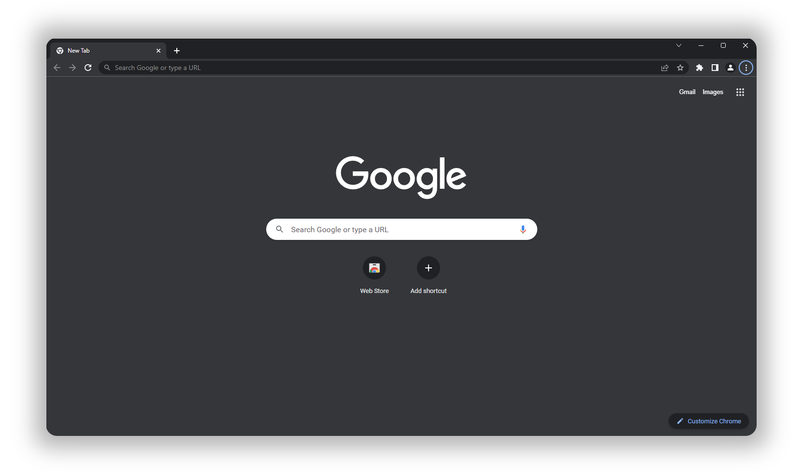
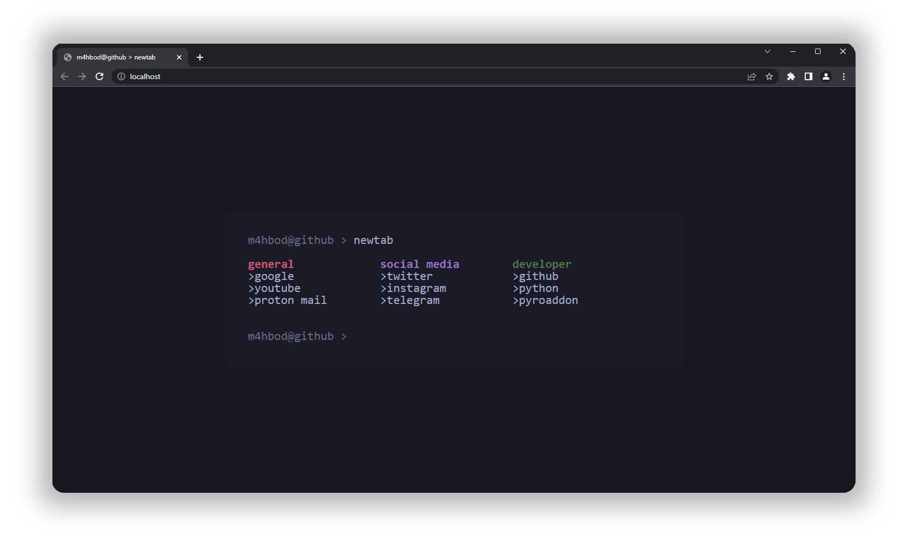

# [Online Preview](https://m4hbod.me/Better-New-Tab/)
<h1>Turn this
<p align="center">
    
</p>

Into This
<p>
    
</p></h1>

# Features
- Search bar
- Groups auto order

# Installation
## 1. Download
### Download the index file from this repository and save it to your computer. You can do this by clicking the green "Code" button and then clicking "Download ZIP". Once you have downloaded the file, unzip it and move the index file to the folder where you want to store it.

<p align="center">
    <br>
    <text style="font-size: 16px;">Download and install extention based on your browser</text>
    <br>
    &nbsp;&nbsp;&nbsp;
    
</p>

## 2. Set New Tab Override
<details>
<summary><b>Chrome</b></summary><br>

1. Open the extensions by typing "chrome://extensions/" in the address bar.
2. Find the "New Tab Redirect" extension and click the "Details" button.
3. Click the "Extension Options" button.
4. Go to the "URL" tab.
5. Paste the path to the index file you unzipped earlier into the "Redirect URL" field.
6. Then click the "Save" button.
</details>

<details>
  <summary><b>FireFox</b></summary>
<br>

1. Open the extensions by typing "about:addons" in the address bar.
2. Go to the "Extensions" tab.
3. Find the "New Tab Override" extension, click the three-dot button, and select options.
4. Set "Option" to "local file".
5. Click "Browse" and select the index file you unzipped earlier.
</details>

## 3. Set focus to built-in search bar [optional]
### First, you need to set up Nginx based on [this](https://github.com/jimschubert/NewTab-Redirect/wiki#page-focus-on-file-redirects) wiki. Then you gotta do the following:
<details>
<summary><b>Chrome</b></summary><br>

1. Go to the "Extension Options" page as you did before.
2. Go to the "URL" tab.
3. Paste "http://localhost" into the "Redirect URL" field.
4. Click the "Save" button.
</details>

<details>
  <summary><b>FireFox</b></summary>
<br>

1. Go to the "New Tab Override" settings as you did before.
2. Set "Option" to "custom URL".
3. Paste "http://localhost" into the "URL" field.
4. Check the "Set focus to the web page instead of the address bar" checkbox. 
</details><br>

# Config
### You can add a new ```<ul>``` tag just like the examples and add your URLs using ```<li>``` tag.
### If you want to change column count, you can change the ```--column-count``` variable in the ```:root``` selector.
